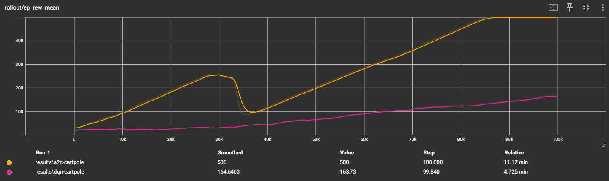
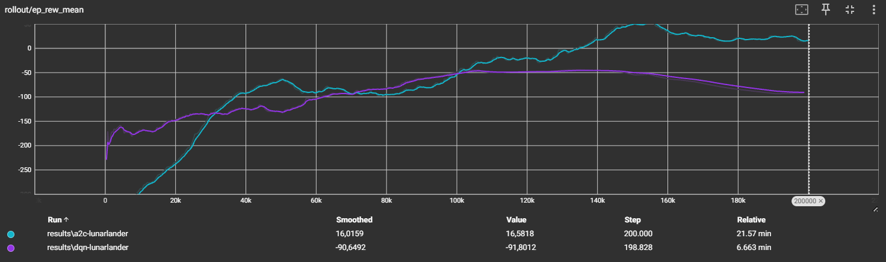
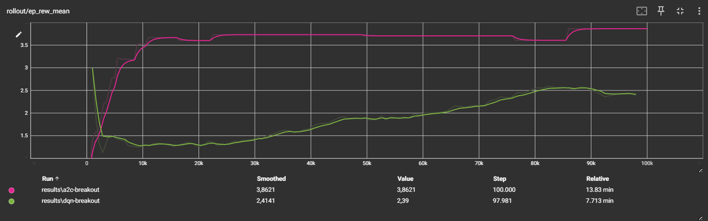

## Comparativo de modelos - A2C vs DQN

O estudo do trabalho presente será focado na comparação entre dois algoritmos de aprendizado por reforço: A2C (Advantage Actor-Critic) e DQN (Deep Q-Network). O objetivo é analisar o desempenho de ambos os algoritmos em diferentes ambientes de simulação, utilizando o framework Gym.

### Definição dos ambientes 

Os ambientes utilizados para o treinamento e teste dos algoritmos são os seguintes:

- **CartPole-v1**: Um ambiente clássico onde o agente deve equilibrar um mastro em pé sobre um carrinho.

- **LunarLander-v3**: Um ambiente onde o agente deve pousar uma nave em uma superfície lunar.

- **Breakout-v5**: Um ambiente de jogo onde o agente deve quebrar blocos com uma bola.

### Metodologia

O tipo de avaliação que faremos será focado em comparar a recompensa média ao longo dos episódios. Essa comparação será feita graficamente para facilitar a visualização dos resultados.

## Resultados

### Ambiente CartPole-v1

Na figura abaixo (gerada pelo tensorboard) é possível ver a comparação entre os algoritmos A2C e DQN no ambiente CartPole-v1. O gráfico mostra a recompensa média ao longo dos episódios para ambos os algoritmos. O A2C apresenta um desempenho superior ao DQN, alcançando uma recompensa média mais alta em menos episódios. O DQN, por outro lado, apresenta uma curva de aprendizado mais lenta, com uma recompensa média menor ao longo do tempo.

### Ambiente LunarLander-v3

Na figura abaixo (gerada pelo tensorboard) é possível ver a comparação entre os algoritmos A2C e DQN no ambiente LunarLander-v3. O gráfico mostra a recompensa média ao longo dos episódios para ambos os algoritmos. O A2C apresenta um desempenho superior ao DQN, alcançando uma recompensa média mais alta em menos episódios. O DQN, por outro lado, apresenta uma curva de aprendizado mais lenta, com uma recompensa média menor ao longo do tempo. Porém, vale ressaltar que não houve tempo suficiente para ambos os algoritmos convergirem para um valor satisfatório de recompensa média, dado o ambiente. Para isso ser corrigido, o tempo de treinamento deve ser aumentado.

### Ambiente Breakout-v5

Na figura abaixo (gerada pelo tensorboard) é possível ver a comparação entre os algoritmos A2C e DQN no ambiente Breakout-v5. O gráfico mostra a recompensa média ao longo dos episódios para ambos os algoritmos. O A2C apresenta um desempenho superior ao DQN, alcançando uma recompensa média mais alta em menos episódios. O DQN, por outro lado, apresenta uma curva de aprendizado mais lenta, com uma recompensa média menor ao longo do tempo. 

## Conclusão

O estudo comparativo entre os algoritmos A2C e DQN mostrou que o A2C apresenta um desempenho superior em todos os ambientes testados. O DQN, embora seja um algoritmo popular, apresentou uma curva de aprendizado mais lenta e uma recompensa média menor ao longo do tempo. Isso sugere que o A2C pode ser uma escolha mais eficaz para os ambientes de simulação escolhidos para o estudo presente.